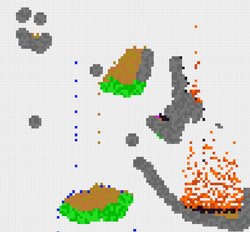

# ElementDots

**ElementDots** is a simple sandbox/2D game for building structures with the help of the Four Elements (earth, air, water & fire) and more.

It's an extended **Conway's Game of Life**.

It's inspired by the POK5's Chrome experiment. More info [here](http://pok5.de/elementdots/ "http://pok5.de/elementdots/ ") and [there](https://www.chromeexperiments.com/experiment/element-dots "https://www.chromeexperiments.com/experiment/element-dots").

It uses the Qt5 framework and is written in C++.

## Download

Download the last release [here](https://github.com/setvisible/element-dots/releases "https://github.com/setvisible/element-dots/releases").

## Build

1. Download `ElementDots-src.tar.gz`.

2. Unzip:

        $ tar zxvf ElementDots-src.tar.gz
        $ cd ElementDots-src/

3. Build it with [QtCreator](https://www.qt.io/developers/ "https://www.qt.io/developers/").

     Compile and run `ElementDots.pro`.

## License

The code is released under the [MIT License](LICENSE "LICENSE").
